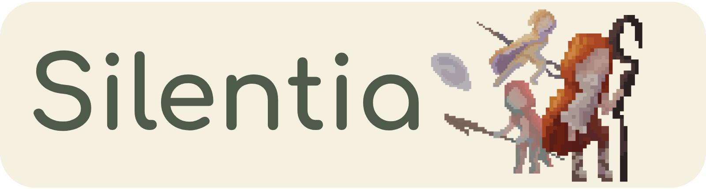
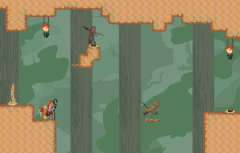
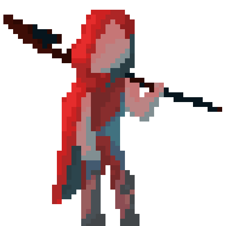
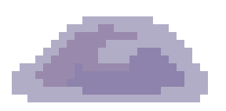
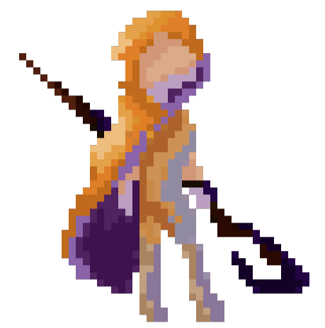

  

&nbsp;
&nbsp;
&nbsp;
&nbsp;

 

### A 2D puzzle-platformer where your past actions return as echoes.

*Your actions never fade — they come back as translucent past selves that solve the temple at your side.*

 

[About](#about)&nbsp;&nbsp;·&nbsp;&nbsp;[Features](#features)&nbsp;&nbsp;·&nbsp;&nbsp;[Characters](#characters)&nbsp;&nbsp;·&nbsp;&nbsp;[Technical overview](#technical-overview)&nbsp;&nbsp;·&nbsp;&nbsp;[Getting started](#getting-started)&nbsp;&nbsp;·&nbsp;&nbsp;[Roadmap](#roadmap)

English&nbsp;·&nbsp;<a href="README.et.md">Eesti keeles</a>

---

## About

Silentia is a 2D puzzle-platformer built around a clone-based mechanic. A silent monk walks the trials of a forgotten temple, where no challenge can be overcome alone. At a shrine, the player steps into one of the monk's inner powers, a *chakra*, and records its movements. Back in the world, that recording returns as a translucent *echo* that repeats the same actions in sync. Every puzzle is solved by coordinating the monk with up to three echoes at once.

Echoes are real participants, not background animation. They press buttons, hold platforms, reach places the monk cannot and stay perfectly in sync with one another.

> [!NOTE]
> Silentia was shaped by two rounds of playtesting with five players, who understood the clone mechanic on their own and found the difficulty fair.

## Features

- **A clone-based mechanic** that records your actions and replays them as translucent echoes
- **Three playable chakras**, each with its own movement ability
- **Puzzles built on timing** and the coordination of several echoes at once
- **An input-based, deterministic replay system** with frame-by-frame drift correction
- **Six hand-crafted levels** that teach the mechanic step by step
- **An original pixel-art world** set in a calm, meditative temple
- Built in **Unity 6** with a data-driven character architecture

## Characters

The monk uses only the core movement set. Three chakras can be recorded as echoes, and **each one exists only once**, so every puzzle depends on cooperation between different powers.

| | Chakra | Element | Ability |
|:--:|:--|:--:|:--|
|  | **Muladhara** | Earth | **Double Jump.** Grounded and steady, reaches what lies high above. |
|  | **Svadhisthana** | Water | **Small Body.** Light and flowing, slips through the narrowest gaps. |
|  | **Manipura** | Fire | **Dash.** Swift and sharp, bursts across open distance. |

## Technical Overview

Silentia uses an input-based replay system. It records the player's inputs rather than their position, then replays them through the same physics engine that drives the monk. This makes each echo a real actor in the world rather than a pre-recorded clip. If a platform existed during the recording but is gone on replay, the echo falls.

To stay reliable over time, the simulation is deterministic. All movement and physics run on a fixed timestep, and a drift-correction system realigns each echo with its recorded state every frame, correcting the floating-point error that builds up over long recordings.

<b>A closer look at the replay system</b>

 

Two design approaches exist for an action-replay system. A **state-based** recorder stores each character's full state, including position, velocity, and internal values, on every step. It is robust, but memory-heavy, and the clone only retraces a fixed path, like a video clip. An **input-based** recorder stores only the player's inputs and rebuilds everything else through simulation. Silentia uses the input-based approach, because the recorded inputs can be sent back through the very same engine that moves the live character, so an echo takes part in the physics world instead of replaying a frozen trajectory.

**Determinism.** Input replay only works if identical inputs always lead to identical results. All movement and physics therefore run inside `FixedUpdate` on a fixed timestep, independent of frame rate, with component execution order pinned explicitly.

**Recording.** On every `FixedUpdate`, a recorder writes the current input into a frame. In parallel, position and velocity snapshots are captured *after* the physics step and stored as periodic keyframes.

**Replay and drift correction.** During playback, the recorded inputs are fed back through the same movement pipeline the live monk uses. Floating-point error still accumulates over long recordings, so a drift corrector checks each echo against its keyframes after every physics step. Minor deviations are smoothly interpolated back onto the recorded path, while large divergences are left untouched, since they mean the level itself has changed rather than the maths drifting.

**Character architecture.** Characters are data-driven. A shared movement engine reads per-character parameters from `ScriptableObject` assets, and each character enables only its own set of ability states. The monk and all three chakras therefore run on one codebase while keeping a distinct feel.

## Getting Started

### Download (Windows)

A ready-to-play build is available under [**Releases**](https://github.com/daria-sav/Silentia/releases).

1. Open the latest release.
2. Download `Silentia_v1.0.0_Windows.zip`.
3. Unzip it and run `Silentia.exe`.

### Build from source

Silentia is a Unity project.

1. Clone this repository.
2. Open it with **Unity 6** or newer.
3. Open the starting scene and press **Play**.

### Controls

| Action | Key |
|:--|:--|
| Move | Arrow keys&nbsp;/&nbsp;WASD |
| Jump | Up&nbsp;/&nbsp;W&nbsp;/&nbsp;Space |
| Dash *(Manipura)* | X |
| Interact · enter a shrine | E |
| Stop recording | Q |
| Spawn all recorded echoes | C |
| Leave the shrine | Esc |
| Clear the selected slot | Delete |

## Roadmap

Silentia is complete as a thesis project, but the temple still has room to grow.

**Shaped by playtester feedback**

- [ ] **Sound and music.** The current build is silent; an ambient score and sound effects are the most requested addition.
- [ ] **A living narrative.** Weaving the story through the levels themselves, with characters who guide the monk deeper into the temple.
- [ ] **More to explore.** Additional levels and a wider variety of temple environments.

**Further ideas**

- [ ] **An unlockable cast.** A new chakra earned with each temple completed.
- [ ] **Enemies and combat.** A light combat layer to broaden the challenge.
- [ ] **Hidden collectibles.** Optional rewards tucked into the hardest corners of a level.
- [ ] **Run statistics.** Deaths, completion times, and per-level progress.

## Built With

- **Unity 6** · engine and tooling
- **C#** · gameplay programming
- **Aseprite** · pixel art and animation
- **Figma** · interface design

## Credits

- **Daria Savtšenko** · game design, programming, and level design
- **Sofia Savtšenko** · art and visual design
- **Mark Muhhin** · thesis supervisor

The movement foundation is adapted from [DawnosaurDev / platformer-movement](https://github.com/DawnosaurDev/platformer-movement), used under the MIT License.

Silentia was created as a Bachelor's thesis at the **University of Tartu**, Institute of Computer Science, in 2026.

## License

Silentia is released under the **Creative Commons Attribution-NonCommercial-NoDerivatives 4.0 International** license (CC BY-NC-ND 4.0). The project may be shared with attribution, but not used commercially or distributed in modified form.

Third-party materials remain under their own licenses. See [LICENSE.md](LICENSE.md) and [THIRD_PARTY_LICENSES.md](THIRD_PARTY_LICENSES.md) for details.

---

<b>Silentia</b> · A Bachelor's thesis at the University of Tartu · Institute of Computer Science · 2026

